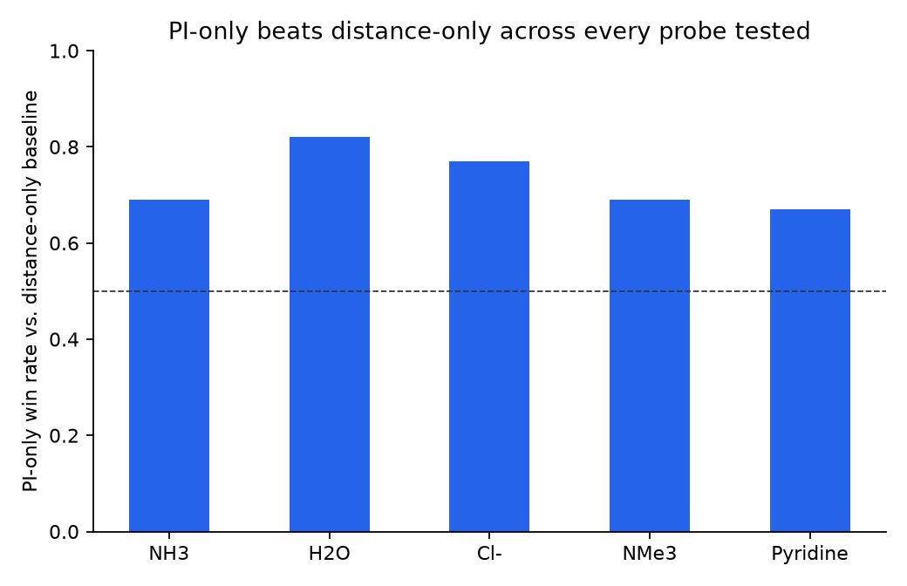

# PI-GNN: a physics-informed edge feature for non-covalent interactions

Can a purely geometric, radial bonding descriptor stand in for raw 3-D
geometry when predicting interaction energies for molecules a model has
never seen? Surprisingly, almost: a graph net given **only** the
Penetration Index (PI) per atom pair — no distance, no way to infer
approach angle — beats the same architecture given raw distance instead,
consistently, across five bond families and five different probe
molecules.

This repo trains and evaluates a small message-passing GNN on 1,170 DFT
single-point energies covering five families of non-covalent interaction
(halogen, chalcogen, pnictogen, tetrel and hydrogen bonds), comparing
two edge-feature conditions — raw distance vs. the Penetration Index — under
a genuine leave-one-electrophile-out generalization test.

> Extracted from a larger research project on non-covalent interaction
> modeling. This repo keeps the ML core — model, training, evaluation,
> results — and drops the surrounding DFT pipeline and internal reports.

## The idea

The [Penetration Index](https://doi.org/10.1039/D3SC03459G) (Echeverría &
Álvarez, *Chem. Sci.* 2023) measures how much two atoms' van der Waals
"crusts" overlap:

```
PI(%) = 100 * (v_A + v_B - d_AB) / (v_A + v_B - r_A - r_B)
```

where `r` is the covalent radius, `v` the van der Waals radius, and `d_AB`
the interatomic distance. It places van der Waals contacts (PI ≈ 0%),
hydrogen/halogen/chalcogen bonds (PI ≈ 20–70%) and covalent bonds
(PI ≥ ~90%) on one continuous, element-pair-normalized scale.

PI is a function of distance alone — two contacts at the same distance get
the same PI regardless of approach angle, and angle matters a lot for
directional non-covalent bonds. So the question this project asks is
deliberately unfair to PI: **if a model is only allowed to see one radial
number per atom pair, is it better off with raw distance, or with PI?**

## Data

1,170 Gaussian16 DFT single-point energies: 39 electrophiles (five
interaction families) × 5 distances × 6 approach angles, each probed with a
fixed NH₃ nucleophile.

| family | electrophiles |
|---|---|
| halogen bond | ClF, BrCl, ICl, IBr, Cl₂, Br₂, I₂, BrF, IF |
| chalcogen bond | SF₂, SeF₂, SeCl₂, SeBr₂, TeF₂, TeCl₂, SBr₂, TeBr₂ |
| pnictogen bond | PF₃, PCl₃, AsF₃, AsCl₃, SbF₃, PBr₃, AsBr₃, SbCl₃ |
| tetrel bond | SiF₄, SiCl₄, GeF₄, SnCl₄, GeCl₄, SnF₄ |
| hydrogen bond | HF, HCl, HBr, HI, H₂O, H₂S, NH₃ (donor), HCN |

Each complex becomes a small fully-connected graph (electrophile + probe,
6–9 atoms). `data/graph_dataset.pt` ships the fully pre-built graphs —
atomic numbers, pairwise distances, pairwise PI, and the DFT energy — so
training runs with no external dependencies and no DFT software.

## Model

A minimal message-passing network, plain PyTorch (no `torch_geometric` —
these graphs are tiny, a dense representation is simpler and just as fast):

1. Atom embedding by atomic number.
2. Two message-passing layers, each aggregating one edge feature per
   pair — `[distance]` or `[PI]` — into every node.
3. Masked mean pooling + an MLP readout for the graph-level energy.

Everything except which single number sits on the edge is identical
between the two conditions, so any difference in accuracy is attributable
to that one swap. See [`src/model.py`](src/model.py).

## Evaluation: leave-one-electrophile-out

The real test isn't interpolating a grid point for a molecule already seen
during training — it's generalizing to a molecule the model has *never*
seen. Every fold trains on 38 electrophiles and tests on the 39th, held out
entirely (not just a held-out geometry of a system already in training).
5 seeds per condition, with validation-based early stopping (single-seed,
fixed-epoch runs were dominated by training noise, not signal — see
[`src/training.py`](src/training.py)'s docstring).

## Results

Mean test MAE (kcal/mol) across all 39 leave-one-electrophile-out folds,
NH₃ probe:

| edge feature | mean MAE | win rate vs. distance |
|---|---|---|
| distance (baseline) | 4.01 | — |
| **PI only** | **3.49** | **69%** |

PI — a single scalar per atom pair, blind to angle — beats raw distance on
average, and wins in 4 of 5 interaction families (loses narrowly on
pnictogen bonds):


Halogen bonds — the most angle-directional family in this dataset — see
the largest gain. Chalcogen bonds move the least, which lines up with a
separate finding from the wider project: chalcogen-bonded systems are the
one family whose interaction energy stays comparatively flat as the
approach angle swings from ideal to perpendicular, so there's less
angle-dependent signal for a purely radial descriptor to be missing in the
first place. The GNN result and the underlying chemistry agree.

### Does this replicate across probes?

The numbers above use a fixed NH₃ probe. Repeating the identical
experiment (same 39 electrophiles, same LOSO protocol) with four other
nucleophile probes — H₂O, Cl⁻, NMe₃, pyridine — shows the same pattern
holds every time, not just for NH₃:



| probe | distance | PI only | PI win rate |
|---|---|---|---|
| NH₃ | 4.01 | 3.49 | 69% |
| H₂O | 2.84 | 2.09 | 82% |
| Cl⁻ | 3.35 | 2.71 | 77% |
| NMe₃ | 4.93 | 4.64 | 69% |
| Pyridine | 3.07 | 2.96 | 67% |

*(MAE in kcal/mol.)* Across all 5×39 = 195 folds tested (five probes ×
39 electrophiles), PI's win rate never drops below 67% — the effect is
consistent, not a fluke of one probe's dataset.

## Running it

```bash
pip install -r requirements.txt
cd src
python train.py --epochs 300 --n-seeds 5 --modes none pi_only
python make_figures.py
```

`train.py` runs the full leave-one-electrophile-out sweep (39 folds ×
3 training fractions × 5 seeds × 2 conditions; a few minutes on CPU).
`results/` already has the numbers behind every table and figure above.

## Repo structure

```
src/
  model.py                small message-passing GNN + tensor-batching
  training.py              one-model train/eval loop with early stopping
  dataset.py                loads the pre-built graph dataset
  train.py                  leave-one-electrophile-out sweep
  make_figures.py           regenerates the figures above
  penindex_mini/              standalone Penetration Index formula (for
                                 reference — the shipped dataset already has
                                 PI baked in)
data/
  graph_dataset.pt          1,170 pre-built graphs (NH3 probe): geometry,
                                distances, PI, energy
results/
  report_pi_ablation.csv    distance vs. PI-only, NH3, per held-out system
  probe_robustness.csv      distance vs. PI-only, all 5 probes tested
figures/
```

## Limitations

- The shipped dataset covers one fixed probe (NH₃); the multi-probe
  robustness check above ran the same code against four other probes'
  graphs, whose raw data isn't included here to keep the repo small — only
  the summary numbers in `probe_robustness.csv`.
- DFT single points, not counterpoise-corrected CCSD(T)/CBS — energies are
  good enough to rank-order interactions but not benchmark-quality absolute
  numbers.
- 39 electrophiles is a real generalization test, but still a small
  battery; the LOSO folds are correlated within a family.
- PI loses (narrowly) on pnictogen bonds — the effect is robust on
  average, not universal.
- This isolates PI vs. distance as competing single features. It doesn't
  test whether combining both would do even better — that's a natural
  next experiment, deliberately left out here to keep the comparison to
  the cleanest possible question.

## Reference

Echeverría, J., & Álvarez, S. (2023). *The borderless world of chemical
bonding across the van der Waals crust and the valence region.* Chemical
Science, 14, 11647–11688.

## License

MIT — see [LICENSE](LICENSE).
