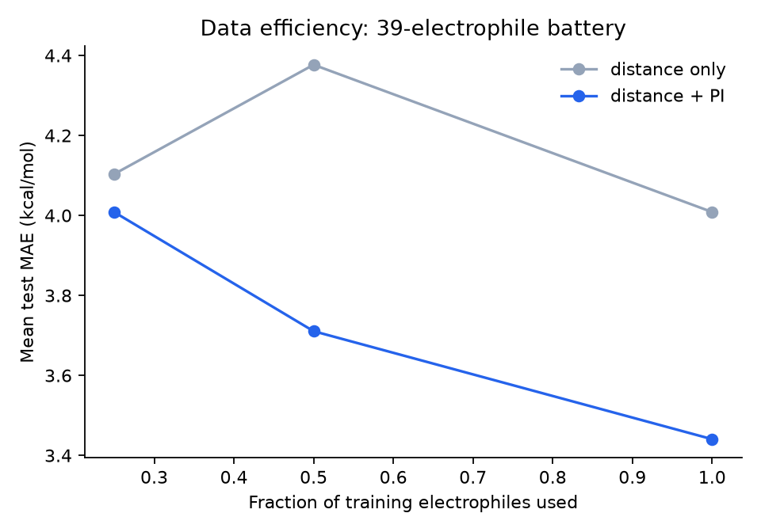
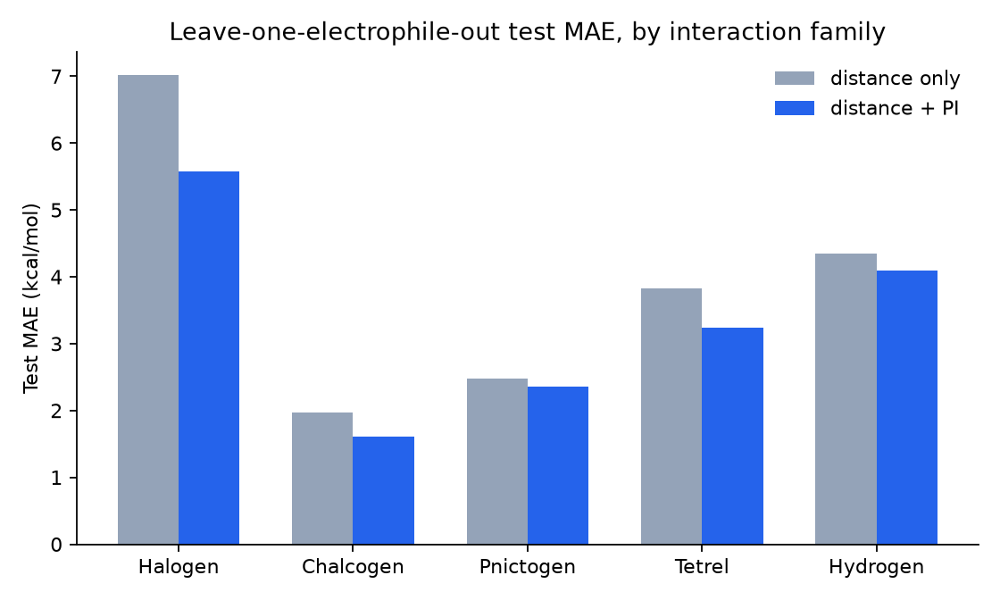

# PI-GNN: a physics-informed edge feature for non-covalent interactions

Does giving a graph neural network a *chemistry-derived* distance descriptor —
instead of just raw distance — help it predict interaction energies for
unseen molecules? Short answer: yes, modestly, and the size of the win
depends on the physics of the bond type in a way that itself makes sense.

This repo trains and evaluates a small message-passing GNN on 1,170 DFT
single-point energies covering five families of non-covalent interaction
(halogen, chalcogen, pnictogen, tetrel and hydrogen bonds), comparing a
plain-distance baseline against the same architecture given one extra edge
feature: the **Penetration Index (PI)**, a purely geometric bonding
descriptor from the computational-chemistry literature.

> Extracted from a larger research project on non-covalent interaction
> modeling. This repo keeps the ML core — model, training, evaluation,
> results — and drops the surrounding DFT pipeline and internal reports.

## The idea

The [Penetration Index](https://doi.org/10.1039/D3SC03459G) (Echeverría &
Álvarez, *Chem. Sci.* 2023) measures how much two atoms' van der Waals
"crusts" overlap:

```
PI(%) = 100 * (v_A + v_B - d_AB) / (v_A + v_B - r_A - r_B)
```

where `r` is the covalent radius, `v` the van der Waals radius, and `d_AB`
the interatomic distance. It places van der Waals contacts (PI ≈ 0%),
hydrogen/halogen/chalcogen bonds (PI ≈ 20–70%) and covalent bonds
(PI ≥ ~90%) on one continuous, element-pair-normalized scale — a strong
correlate of interaction energy on its own.

But PI is a function of distance alone. Two contacts at the same distance
get the same PI regardless of approach angle — and angle matters a lot for
directional non-covalent bonds. So the question this project asks is
narrow and testable: **does handing PI to a model that can also see full
3‑D geometry give it a genuinely useful shortcut, or is it redundant once
the model already has the raw distances?**

## Data

1,170 Gaussian16 DFT single-point energies: 39 electrophiles (five
interaction families) × 5 distances × 6 approach angles, each probed with a
fixed NH₃ nucleophile.

| family | electrophiles |
|---|---|
| halogen bond | ClF, BrCl, ICl, IBr, Cl₂, Br₂, I₂, BrF, IF |
| chalcogen bond | SF₂, SeF₂, SeCl₂, SeBr₂, TeF₂, TeCl₂, SBr₂, TeBr₂ |
| pnictogen bond | PF₃, PCl₃, AsF₃, AsCl₃, SbF₃, PBr₃, AsBr₃, SbCl₃ |
| tetrel bond | SiF₄, SiCl₄, GeF₄, SnCl₄, GeCl₄, SnF₄ |
| hydrogen bond | HF, HCl, HBr, HI, H₂O, H₂S, NH₃ (donor), HCN |

Each complex becomes a small fully-connected graph (electrophile + probe,
6–18 atoms). `data/graph_dataset.pt` ships the fully pre-built graphs —
atomic numbers, pairwise distances, pairwise PI, and the DFT energy — so
training runs with no external dependencies and no DFT software.

## Model

A minimal message-passing network, plain PyTorch (no `torch_geometric` —
these graphs are tiny, a dense representation is simpler and just as fast):

1. Atom embedding by atomic number.
2. Two message-passing layers, each aggregating `[distance]` or
   `[distance, PI]` per edge into every node.
3. Masked mean pooling + an MLP readout for the graph-level energy.

Everything except the edge feature set is identical between the baseline
and PI-augmented models, so any difference in accuracy is attributable to
that one feature. See [`src/model.py`](src/model.py).

## Evaluation: leave-one-electrophile-out

The real test isn't interpolating a grid point for a molecule already seen
during training — it's generalizing to a molecule the model has *never*
seen. Every fold trains on 38 electrophiles and tests on the 39th, held out
entirely (not just a held-out geometry of a system already in training).
5 seeds per condition, with validation-based early stopping (single-seed,
fixed-epoch runs were dominated by training noise, not signal — see
[`src/training.py`](src/training.py)'s docstring).

## Results

Mean test MAE (kcal/mol) across all leave-one-electrophile-out folds, as
the training battery scales from 14 to 39 electrophiles:

| electrophiles | distance only | distance + PI | improvement | win rate |
|---|---|---|---|---|
| 14 | 5.46 | 6.59 | −21% (net loss) | ~57% |
| 26 | 4.39 | 3.78 | +14% | 77% |
| 30 | 4.30 | 3.48 | +19% | 83% |
| 39 | 4.01 | 3.44 | +14% | 82% |



At the full 39-electrophile battery, PI wins in **all five** interaction
families, but by very different margins:



Halogen bonds — the most angle-directional family in this dataset — see
the largest gain. Chalcogen bonds barely move, which lines up with a
separate finding from the wider project: chalcogen-bonded systems are the
one family whose interaction energy stays comparatively flat as the
approach angle swings from ideal to perpendicular, so there's less
angle-dependent signal for a purely radial feature to be missing in the
first place. The GNN result and the underlying chemistry agree.

### Why 14 electrophiles looked like a *loss*

The first pass at this experiment, with only 14 electrophiles, showed PI
making predictions *worse*. Before concluding PI just doesn't help, an
ablation restricted PI to only the one chemically meaningful contact per
complex (instead of every atom pair, most of which are constant
intramolecular distances or chemically irrelevant). That fixed the
instability at 14 systems — evidence the original failure was **data
starvation** for a ~100-dimensional edge feature space, not a flaw in
giving PI to every edge. As the battery grew to 26, 30 and 39 systems, the
full-PI model overtook the restricted one and kept improving, confirming
the diagnosis.

## Running it

```bash
pip install -r requirements.txt
cd src
python train.py --epochs 300 --n-seeds 5 --out ../results/report.csv
python make_figures.py
```

`train.py` runs the full leave-one-electrophile-out sweep (39 folds ×
3 training fractions × 5 seeds × 2 conditions = 1,170 short training runs;
a few minutes on CPU). `results/report_39systems.csv` has the numbers
behind the table and figures above, already generated.

## Repo structure

```
src/
  model.py           small message-passing GNN + tensor-batching
  training.py        one-model train/eval loop with early stopping
  dataset.py         loads the pre-built graph dataset
  train.py           leave-one-electrophile-out sweep
  make_figures.py    regenerates the two figures above
  penindex_mini/     standalone Penetration Index formula (for reference —
                      the shipped dataset already has PI baked in)
data/
  graph_dataset.pt   1,170 pre-built graphs (geometry + distances + PI + energy)
results/
  report_39systems.csv
figures/
```

## Limitations

- One fixed probe (NH₃) — the model has never seen a different nucleophile.
- DFT single points, not counterpoise-corrected CCSD(T)/CBS — energies are
  good enough to rank-order interactions but not benchmark-quality absolute
  numbers.
- 39 electrophiles is a real generalization test, but still a small
  battery; the LOSO folds are correlated within a family.
- The effect is genuine but modest (~15% MAE reduction) — this is evidence
  PI is a useful complementary feature, not a replacement for letting the
  model see full 3-D geometry.

## Reference

Echeverría, J., & Álvarez, S. (2023). *The borderless world of chemical
bonding across the van der Waals crust and the valence region.* Chemical
Science, 14, 11647–11688.

## License

MIT — see [LICENSE](LICENSE).
